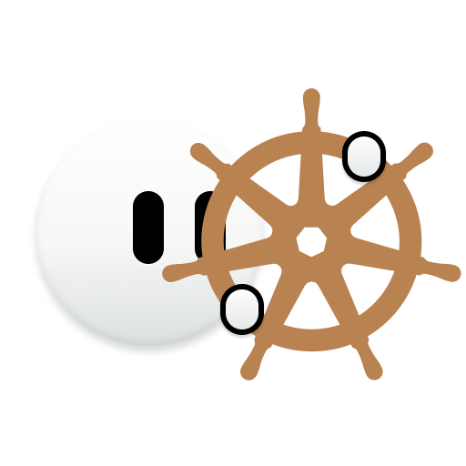
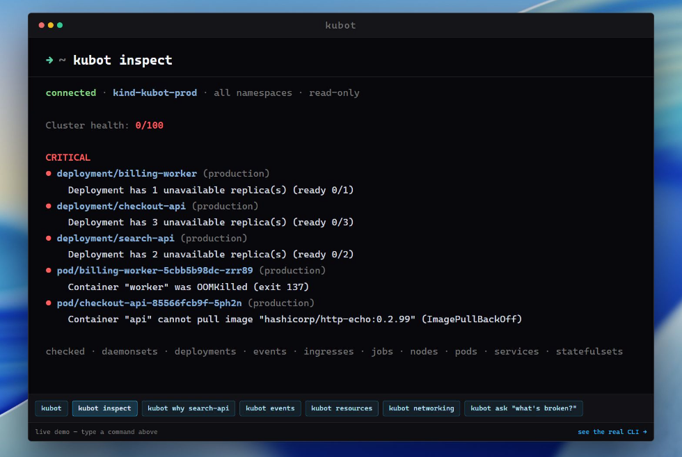
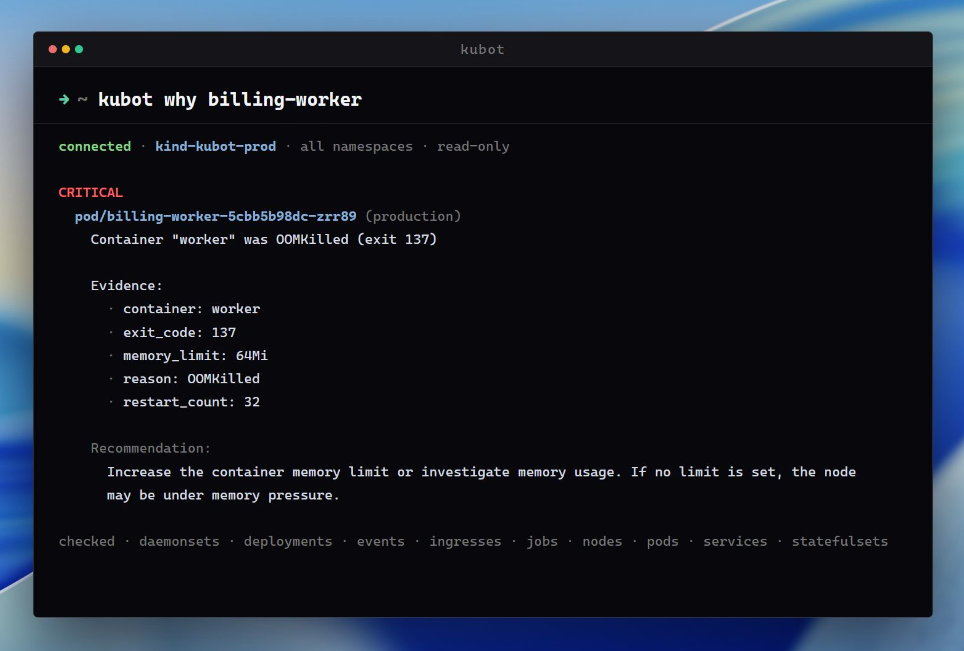
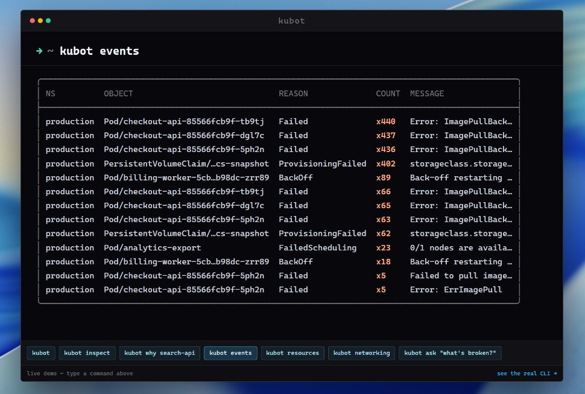

<p align="center">
  
</p>

<h1 align="center">kubot</h1>

<p align="center">
  <strong>Kubernetes diagnostics for humans and AI agents.</strong><br>
  One static binary connects read-only, reads the cluster's own state,
  and prints a findings-first health report — plus <em>why</em> it's sick.<br>
  No operator, no webhook, no write privilege anywhere in the path.
</p>

<p align="center">
  <a href="https://github.com/kubotdev/kubot/actions/workflows/ci.yml"></a>
  <a href="https://github.com/kubotdev/kubot/releases/latest"></a>
  <a href="https://pkg.go.dev/github.com/kubotdev/kubot"></a>
  <a href="LICENSE"></a>
</p>

<p align="center">
  <a href="#quickstart">Quickstart</a> ·
  <a href="#install">Install</a> ·
  <a href="#commands-and-flags">Commands</a> ·
  <a href="#ci-integration">CI</a> ·
  <a href="#mcp--use-kubot-as-an-agent-tool">MCP</a> ·
  <a href="#the---json-contract">JSON contract</a> ·
  <a href="#troubleshooting">Troubleshooting</a>
</p>

> **Status: early.** The `--json` contract is versioned (currently `1.0.0`,
> JSON Schema published in [`schema/`](schema/)) and breaking changes to it
> are treated as breaking changes to the tool. The human-readable report is
> **not** a stable interface — parse `--json`, not the terminal output.
> Expect sharp edges elsewhere.

---

## Quickstart

```sh
curl -fsSL https://raw.githubusercontent.com/kubotdev/kubot/main/install.sh | sh
kubot inspect
```

No cluster handy? Spin up a local one:

```sh
kind create cluster
kubot inspect
```

A healthy cluster reports `OK — no problems detected` and exit code 0.
A sick one tells you what's wrong, why, and what to check next:

```
connected · kind-kubot-prod · namespace production · read-only

Namespace health: 0/100

CRITICAL
● deployment/checkout-api (production)
    Deployment has 3 unavailable replica(s) (ready 0/3)
● pod/checkout-api-85566fcb9f-5ph2n (production)
    Container "api" cannot pull image "hashicorp/http-echo:0.2.99" (ImagePullBackOff)

WARNING
● service/admin-console (production)
    Service selector matches no pods

checked · daemonsets · deployments · events · ingresses · jobs · nodes · pods · services · statefulsets

Details: kubot inspect --full   ·   Machine-readable: --json
Ask it: kubot ask "why is checkout down?"
```

The default report is a **graded read**: a health score, then findings
bucketed CRITICAL / WARNING / NOTE. `kubot inspect --full` adds the evidence
and recommendation per finding; focused commands (`events`, `resources`,
`networking`) each drill into one signal; `kubot why <workload>` filters the
diagnosis to one workload; `kubot ask "…"` puts a plain-language AI reading
on top of the same findings. `--json` is the complete, versioned contract
for agents and scripts.

```
$ kubot ask "why is checkout down?" --yes

Checkout is down because its pods never started.

1 critical issue:
checkout-api has 0/3 pods ready — the image tag 0.2.99 was never
published, so every pod is stuck in ImagePullBackOff.

Recommended:
fix the image tag to a published release and re-roll the deployment.
```

## Why kubot

| | |
|---|---|
| **Read-only by construction, not by flag** | kubot only ever performs GET/LIST against the API server. A read-only role is sufficient and recommended — there is nothing a diagnosis can break. |
| **It diagnoses, not describes** | `kubectl` shows raw state; kubot connects the signals (pods → events → deployments → services → probes → limits) and tells you what is wrong, why, what's affected, and what to check next. |
| **Findings are deterministic** | Every finding is computed in Go from API state. The optional AI layer explains findings; it never generates them. |
| **Nothing to deploy** | One static binary. No operator, no CRD, no webhook, no time-series database, no service to run. |
| **Built for agents** | `--json` is a versioned contract; `kubot mcp` exposes the same findings over the Model Context Protocol. |

## Requirements

- A kubeconfig that can read the cluster — the same resolution as kubectl:
  `--kubeconfig`, `$KUBECONFIG`, `~/.kube/config`, `--context`, or
  in-cluster config when kubot runs inside the cluster.
- Any recent Kubernetes (tested against kind's current release).
- `metrics-server` for the usage-based checks (containers at 80%+ of their
  limit). Optional: kubot degrades with a visible note when it's absent
  instead of failing.

## See it

**`kubot inspect`** — the findings-first health report: score, then
worst-first findings with the affected resource.



**`kubot why billing-worker`** — the diagnosis filtered to one workload, always
in full detail: the terminated-container evidence (exit code, limit, restart
count) plus the recommendation. Misspell a workload and it suggests names
instead of shrugging.



**`kubot events`** — warning events as a real table, most repeated first.
The fastest way to see what the cluster has been complaining about.



## Commands and flags

Global flags (every command): `--kubeconfig`, `--context`, `-n/--namespace`
(default: all namespaces), `--timeout`, `--no-color`, `--config`.

| Command | What it does |
|---|---|
| `inspect [workload]` | the full findings-first health report (`--full` for evidence + recommendations per finding) |
| `why <workload>` | the diagnosis filtered to one workload, always in full detail (with typo suggestions) |
| `events` | warning events as a table, most repeated first |
| `resources` | per-container requests/limits/usage table plus resource findings |
| `networking` | service, probe, and ingress findings |
| `check` | CI gate: one line per issue plus the exit code |
| `ask "…"` · `explain [workload]` | a plain-language AI reading of the same deterministic findings |
| `mcp` | serve the findings to an AI agent over MCP |

Key `inspect` flags:

| Flag | |
|---|---|
| `--json` · `--format=text\|json\|sarif\|junit` | output format; SARIF uploads to the GitHub Security tab, JUnit feeds Jenkins/GitLab test panes |
| `--fail-on=critical\|warn\|info\|none` | the severity that makes the exit code non-zero (default `none` — `inspect` reports, `check` gates) |
| `--full` | show evidence and recommendations per finding |
| `--config <path>` | a `.kubot.toml` for `[[ignore]]` suppression rules |

Exit codes are a scriptable contract: `0` clean · `1` warning · `2`
critical · `3` connection/execution failure · `64` usage error (bad
flags/args). Suppressed findings never move them.

## Install

```sh
curl -fsSL https://raw.githubusercontent.com/kubotdev/kubot/main/install.sh | sh
```

Or build from source (needs Go):

```sh
go install github.com/kubotdev/kubot/cmd/kubot@latest
```

The script downloads the release archive for your OS/arch from GitHub
Releases (Linux/macOS `.tar.gz`, Windows `.zip`), verifies its sha256
checksum always, and the cosign signature (keyless, GitHub Actions OIDC)
when `cosign` is on PATH. Pin a version with `KUBOT_VERSION=v0.2.0`,
change the destination with `KUBOT_INSTALL_DIR`. To re-install or upgrade,
re-run the same command. `KUBOT_REQUIRE_SIGNATURE=1` makes the signature
mandatory:

```sh
KUBOT_REQUIRE_SIGNATURE=1 curl -fsSL https://raw.githubusercontent.com/kubotdev/kubot/main/install.sh | sh
```

Release binaries report their version via `kubot --version`; local
`go build` reports `dev`.

## Point kubot at your cluster

kubot resolves the cluster exactly like kubectl — `--kubeconfig`,
`$KUBECONFIG`, `~/.kube/config` — plus `--context` and `-n/--namespace`
to scope a run:

```sh
kubot inspect                                # whole cluster, all namespaces
kubot inspect -n production                  # one namespace
kubot inspect checkout-api                   # one workload
kubot inspect --context kind-kubot-prod      # one context
kubot why billing-worker -n production       # why is it unhealthy
```

An unreachable cluster is a loud error (`kubot: cannot reach cluster`),
never a fake-OK. A cluster without metrics-server gets a visible
`unavailable` note on the usage checks, not silence.

## Usage

```
kubot inspect [workload]       # whole cluster, namespace, or workload
  --full                 evidence and recommendations per finding
  --json                 emit the versioned report (the agent/script contract)
  --format=text|json|sarif|junit
  --fail-on=critical|warn|info|none
  --no-color             disable ANSI (also honors NO_COLOR and non-TTY)

kubot why <workload>           # one workload, always full detail
kubot events                   # warning events by count
kubot resources                # usage table + resource problems
kubot networking               # service + probe + ingress problems
kubot check --fail-on=critical # CI gate, exits non-zero when sick
kubot ask "why is it slow?"    # AI answer grounded in the findings
  --yes                  skip the data-disclosure confirmation prompt
kubot explain [workload]       # report plus an AI reading of it
kubot mcp                      # run as an MCP server over stdio (for AI agents)
```

### MCP — use kubot as an agent tool

`kubot mcp` speaks the [Model Context Protocol](https://modelcontextprotocol.io)
on stdio, so an AI agent can call kubot as a read-only tool. It exposes
**deterministic** tools only and lets the *connected model* do the explaining:

- `inspect` — full findings as JSON
- `why` — the diagnosis filtered to one workload

It also exposes a **`diagnose` prompt** (a one-click "inspect and give me a
prioritized diagnosis" workflow) and a **`kubot://schema` resource** (the
report's JSON Schema) — so tools, prompts, and resources are all available
to the agent.

Point it at a cluster:

```json
{
  "mcpServers": {
    "kubot": {
      "command": "kubot",
      "args": ["--context", "my-cluster", "mcp"]
    }
  }
}
```

kubot never writes, so there's nothing an agent can break through it.

### `ask` / `explain` — optional AI layer

`kubot ask` and `kubot explain` run the exact same read-only inspection,
then ask a model to **explain and prioritize** the findings in plain
language. The findings are still computed locally in Go — the model only
interprets them, it never invents them. Before sending anything, kubot names
the provider and model and asks for confirmation. Local endpoints skip the
prompt; `--yes` skips it in scripts and recordings.

```sh
export OPENAI_API_KEY=sk-…        # or ANTHROPIC_API_KEY, or GEMINI_API_KEY
kubot ask "what needs attention?"
kubot explain billing-worker
```

| Variable | Purpose |
|---|---|
| `OPENAI_API_KEY` / `ANTHROPIC_API_KEY` / `GEMINI_API_KEY` | Enables `ask` / `explain` (auto-detected in that order) |
| `KUBOT_AI_PROVIDER` | `openai`, `anthropic`, or `gemini` — pick one explicitly |
| `KUBOT_AI_MODEL` | Model override (defaults work, override for newer ones) |
| `KUBOT_AI_BASE_URL` | OpenAI-compatible endpoint (Ollama, vLLM, OpenRouter, …) |
| `KUBOT_AI_API_KEY` | Key override for whichever provider is selected, plus optional base URL for local models |

## CI integration

kubot is built to run in a pipeline. `check` exists so pipelines don't
have to remember flags; `--fail-on` decouples the exit code from the
default severity map, and `--format` emits machine-readable reports:

```sh
kubot check --fail-on=critical
kubot inspect --fail-on=critical --format=sarif > kubot.sarif
```

`--format=sarif` produces SARIF 2.1.0 — upload it and every finding lands
in the repo's Security tab. `--format=junit` feeds Jenkins/GitLab test
panes. Suppressed findings stay visible and never affect the exit code.

## The `--json` contract

`kubot inspect --json` (and `--format=json`) is the interface to build on —
a versioned report (`schema_version`, currently `1.0.0`) whose
machine-checkable JSON Schema is published in [`schema/`](schema/):

```json
{
  "schema_version": "1.0.0",
  "status": "critical",
  "issues": [
    {
      "severity": "critical",
      "resource": "pod/payments-api-68ffdf658-m2wq4",
      "reason": "pod_oom_killed",
      "message": "Container \"api\" was OOMKilled (exit 137)",
      "evidence": {"memory_limit": "64Mi", "restart_count": 44, "exit_code": 137},
      "recommendation": "Increase the container memory limit or investigate memory usage."
    }
  ]
}
```

Versioning policy: additive fields bump the minor version and are not
breaking; breaking changes to the contract are treated as breaking changes
to the tool.

## What it checks

Twenty-three checks across pods, workloads, services, storage, nodes,
ingress, and jobs — CrashLoopBackOff (incl. backoff window), OOMKilled,
image pulls, pending pods (with scheduler context), failing probes
(sustained only — Ready pods stay silent), unavailable
Deployments/StatefulSets/DaemonSets, services without endpoints, missing
or suspiciously low (under 32Mi) requests/limits, 80%+ usage (needs
metrics-server), deployment risk aggregates, stalled rollouts, leftover
ReplicaSets, pending PVCs, mount failures, node pressure, three ingress
rules, failed Jobs, and failing CronJobs.

Every finding has a reference page under [`docs/findings/`](docs/findings/README.md) —
what it observed, how to verify it yourself with read-only kubectl, and a
pasteable ignore block. Or read one straight from the binary's catalogue
via its reason id.

## Configuration & suppression

Tolerated noise gets muted, never hidden. A `.kubot.toml` beside the repo
(or `--config`, or `$KUBOT_CONFIG`):

```toml
[[ignore]]
finding = "deployment_resource_risk"
reason = "limits rollout is scheduled next quarter"

[[ignore]]
finding = "pod_missing_resources"
object = "default/limitless-*"
reason = "batch job, intentionally bare"
```

Suppression is always **visible** — muted findings stay in the report
(marked with the reason) and in `--json`, but never move the exit code or
the health score. Rules without a reason are rejected — write why.
Credential-shaped keys are refused outright. Full contract in
[`docs/configuration.md`](docs/configuration.md).

## Roadmap and non-goals

- **Baselines/diff ("what changed")** is the biggest planned feature —
  correctly deferred until the point-in-time diagnosis is solid.
- **HPA/PDB awareness and Jobs-adjacent depth** are the named diagnostic
  holes; security checks (root, privileged, seccomp) are untouched.
- **AI is optional and explain-only.** Findings are always computed
  deterministically — no model ever generates one.
- **kubot never writes.** It recommends; it doesn't apply. A diagnostic
  tool with write access needs 10× the trust.

## Troubleshooting

<details>
<summary><strong><code>kubot: cannot reach cluster</code></strong></summary>

kubot can't talk to the API server — wrong context, expired credentials,
or the cluster is down (after a Docker Desktop restart, kind's published
port can go missing; check `docker ps` and `kubectl cluster-info`). This
is deliberately loud: an unreachable cluster is an error, never a
fake-OK clean report.

</details>

<details>
<summary><strong><code>unavailable: pod usage unavailable</code></strong></summary>

`metrics-server` isn't installed or isn't serving yet. The usage-based
checks (containers at 80%+ of their limit) degrade with this visible note
instead of failing. Install metrics-server to clear it; everything else
works without it.

</details>

<details>
<summary><strong>No problems detected for a workload that looks sick</strong></summary>

Check the namespace — `kubot why payments-api` without `-n` searches all
namespaces, but a typo'd name gets a `Did you mean:` suggestion. If the
workload is in `kube-system` or is a mirror pod, kubot skips it where the
advice would be unactionable.

</details>

## Privacy

Nothing leaves the machine unless you ask for it: every command except the
AI layer is entirely local. The only commands that make an outbound call
are `kubot ask` and `kubot explain`, which send the findings to your
configured model — and say so first, naming the provider and model, with a
confirmation prompt. A local endpoint (Ollama, vLLM on this machine) sends
nothing off the box.

## Develop

```sh
go build ./...
go test ./...
go run ./tools/schemagen   # regenerate schema/ from the Go types after changing them
```

Full docs live in [`docs/`](docs/README.md) — install, commands, config,
JSON, MCP, AI, findings, troubleshooting, architecture.

Contributions welcome — read [`CONTRIBUTING.md`](CONTRIBUTING.md) first.

## License

[Apache-2.0](LICENSE).
